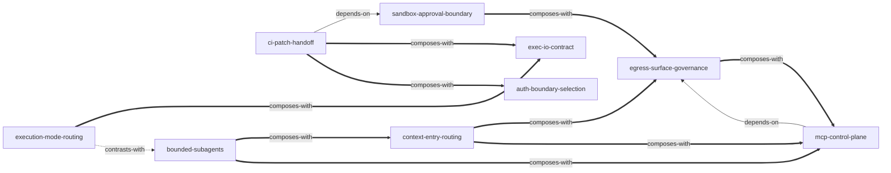

# Codex CLI Official Documentation — Skill Index

> cangjie-skillで OpenAI 公式資料15件を蒸留し、**9 skills**を構築した。
> 処理日: 2026-08-17

初めて読む場合は、専門知識を前提にしない [README.md](./README.md) から始めてください。

## この資料群について

- **著者**: OpenAI
- **公開年**: 継続更新資料（固定取得日 2026-08-17）
- **一言主旨**: Codex CLIを、文脈・実行面・権限・出力・検証の明示契約として運用する。
- **全体理解**: [BOOK_OVERVIEW.md](./BOOK_OVERVIEW.md)
- **精華長文**: [DIGEST.md](./DIGEST.md)
- **用語集**: [GLOSSARY.md](./GLOSSARY.md)
- **固定source**: [SOURCE_MANIFEST.md](./SOURCE_MANIFEST.md)

## Skill一覧

### 実行と自動化

- [`codex-execution-mode-routing`](./codex-execution-mode-routing/SKILL.md) — CLI・exec・cloudを介入モデルで選ぶ。
- [`codex-exec-io-contract`](./codex-exec-io-contract/SKILL.md) — execのprogress、event、最終値を機械契約へ分ける。
- [`codex-ci-patch-handoff`](./codex-ci-patch-handoff/SKILL.md) — CIの推論credentialとwrite authorityをpatchで分離する。

### 安全境界と接続

- [`codex-sandbox-approval-boundary`](./codex-sandbox-approval-boundary/SKILL.md) — 技術的能力と人の昇格同意を二層で設計する。
- [`codex-egress-surface-governance`](./codex-egress-surface-governance/SKILL.md) — search・command・MCP・HTTPの通信経路を個別統制する。
- [`codex-auth-boundary-selection`](./codex-auth-boundary-selection/SKILL.md) — 利用面ごとに認証flowとcredential scopeを選ぶ。
- [`codex-mcp-control-plane`](./codex-mcp-control-plane/SKILL.md) — MCPの必須性・tool範囲・approvalを分離する。

### 文脈と分業

- [`codex-context-entry-routing`](./codex-context-entry-routing/SKILL.md) — image・search・MCP・conversationから適切な入口を選ぶ。
- [`codex-bounded-subagents`](./codex-bounded-subagents/SKILL.md) — read-heavyなbounded roleへ分解して親で再統合する。

## 関係図

図例: `-->` はdepends-on、`-.->` はcontrasts-with、`===>` はcomposes-with。

## 推奨学習順

1. **codex-execution-mode-routing** — まずtaskをどの実行面へ置くか決める。
2. **codex-sandbox-approval-boundary** — 実行主体の能力と昇格条件を分ける。
3. **codex-exec-io-contract** — 非対話実行を選んだ場合の機械契約を作る。
4. **codex-auth-boundary-selection** — 利用面へcredential flowを対応させる。
5. **codex-egress-surface-governance** — 外向き通信をsurface別に監査する。
6. **codex-mcp-control-plane** — MCP surfaceをserver・tool・approvalへ掘り下げる。
7. **codex-context-entry-routing** — 問題に必要な外部contextの入口を選ぶ。
8. **codex-bounded-subagents** — contextとauthorityをbounded roleへ分ける。
9. **codex-ci-patch-handoff** — 上記の境界と契約をCI job分離へ統合する。

## 監査軌跡

- 候補池: [candidates/](./candidates/)
- 三重検証: [verified.md](./verified.md)
- 統合記録: [merged.md](./merged.md)
- 棄却理由: [rejected/](./rejected/)
- 単一ページ版の停止記録: [audit/single-page/](./audit/single-page/)
